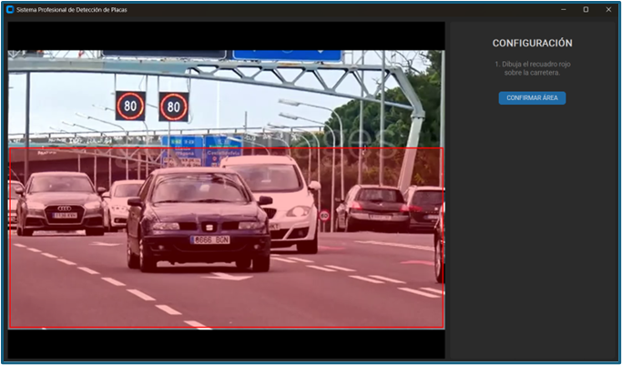
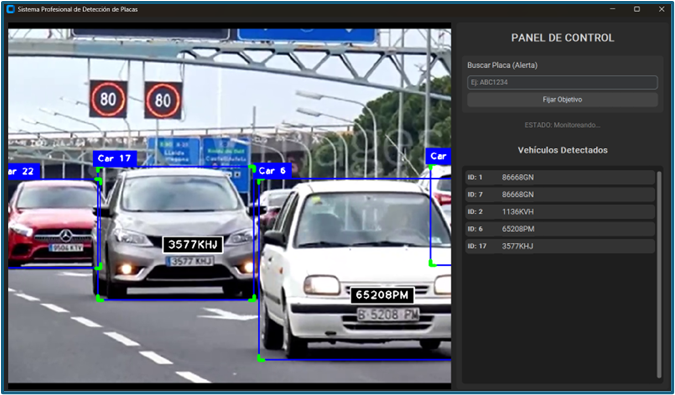
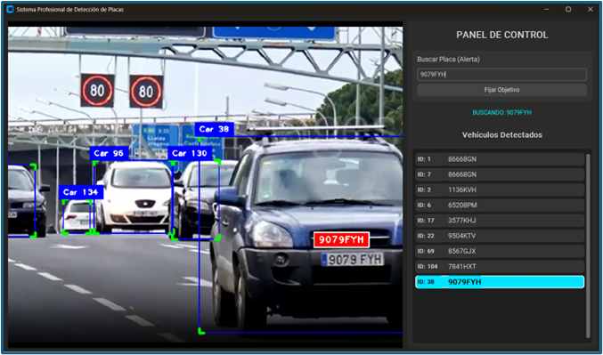

# Proyecto Final: Sistema de Detección de Placas (ANPR)

Este repositorio contiene la implementación en Python de un **Sistema Automático de Reconocimiento de Placas (ANPR)**, desarrollado como proyecto final para la materia de Inteligencia Artificial. El proyecto destaca por su capacidad de operar en **tiempo real**, integrar una **interfaz gráfica moderna** y permitir la **búsqueda de objetivos específicos** con alertas audiovisuales.

## ¿Qué tecnologías utiliza?

El sistema combina varios modelos de vanguardia para lograr una detección precisa y eficiente:

* **YOLOv11 (Nano):** Se utiliza la versión más ligera ("Nano") de YOLO para la detección y seguimiento (*tracking*) de vehículos, optimizando los FPS.
* **Modelo Custom (YOLO):** Un segundo modelo entrenado específicamente para localizar la región exacta de la placa dentro del vehículo.
* **PaddleOCR:** Motor de reconocimiento óptico de caracteres para extraer el texto de la matrícula.
* **CustomTkinter:** Para la interfaz gráfica de usuario (GUI) en modo oscuro.

### ¿Cómo funciona el flujo?
1.  **Selección de ROI:** El usuario define manualmente el área de interés (carretera) para ahorrar recursos computacionales.
2.  **Detección y Tracking:** Se identifican los vehículos y se les asigna un ID único.
3.  **Extracción y OCR:** Se recorta la placa, se aplica un zoom digital y se lee el texto.
4.  **Lógica de Memoria:** El sistema guarda el historial de lecturas. Si una nueva lectura es más larga o tiene mayor confianza, actualiza el registro (evitando parpadeos o errores por distancia).
5.  **Limpieza de Datos:** Se aplica **Regex** para eliminar caracteres basura (guiones, puntos), dejando solo alfanuméricos (`[^A-Z0-9]`).

---

## Sobre el Código

Este script (`main.py`) integra la lógica de visión artificial con una aplicación de escritorio robusta.

**Características principales:**
* **Persistencia Visual:** Dibuja los recuadros de detección incluso en los *frames* que la IA salta para optimizar velocidad, logrando una visualización fluida.
* **Búsqueda de Objetivos:** Permite ingresar una matrícula (ej. `ABC1234`). Si el sistema la detecta, emite una **alerta sonora** y resalta el vehículo en color **cian/turquesa**.
* **Optimización:** Procesa la IA cada 3 cuadros (*frame skipping*) y utiliza algoritmos de redimensionado rápido (`Nearest Neighbor`) para maximizar el rendimiento.

---

## Visualización y Resultados

En esta sección se muestra el funcionamiento del sistema en sus diferentes etapas.

### 1. Configuración de Área (ROI)
> *Estado inicial: El usuario dibuja un recuadro rojo transparente para definir dónde buscará el sistema.*




### 2. Detección en Tiempo Real
> *El sistema rastrea múltiples vehículos, mostrando su ID y la placa detectada limpia de caracteres especiales.*



### 3. Alerta de Objetivo Encontrado
> *Al buscar una placa específica, el sistema activa la alerta: el recuadro se vuelve rojo, la tarjeta en la lista se vuelve turquesa y suena una alarma.*




---

## Cómo ejecutar

Para correr este proyecto en tu máquina local:

1.  Clona el repositorio:
    ```bash
    git clone (https://github.com/AlanDorantesVerdin/ia_proyectofinal.git)
    ```
2.  Navega a la carpeta:
    ```bash
    cd ia_proyectofinal
    ```
3.  Instala las dependencias necesarias:
    ```bash
    pip install opencv-python numpy paddlepaddle paddleocr ultralytics cvzone customtkinter pygame pillow
    ```
4.  Ejecuta el script principal:
    ```bash
    python main.py
    ```
    *(**Importante:** Para la correcta ejecucion del programa es necesario usar Python version 3.10).*

---

## Autor

* **Alan Dorantes Verdin** - [GitHub Profile](https://github.com/AlanDorantesVerdin)